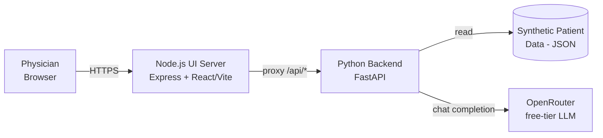

# High-Level Design (HLD)

## Banner Health — AI Clinical Documentation Assistant (Prototype)

## 1. Purpose

Physician burnout is driven heavily by documentation load. This system prototypes an AI
assistant that reduces that load in two ways:

1. **Chart summarization** — condenses a patient's history into a short clinical brief.
2. **Note drafting** — turns a physician's raw encounter notes into a structured SOAP note.

Scope is intentionally limited: **standalone prototype**, **synthetic patient data only**, no
real PHI, no EHR integration, LLM calls routed through **OpenRouter free-tier models**.

## 2. System Context

The physician only ever talks to the UI server. The UI server proxies all `/api/*` calls to the
Python backend, which is the only component that talks to OpenRouter or reads patient data.

## 3. Components

| Component | Technology | Responsibility |
|---|---|---|
| **Browser SPA** | React (Vite) | Patient selection, chart display, note-drafting UI, calls `/api/*` |
| **UI server** | Node.js + Express | Serves the built SPA; reverse-proxies `/api/*` to the backend (keeps the browser same-origin, avoids CORS) |
| **Backend API** | Python + FastAPI | Owns patient data, builds prompts, calls the LLM, exposes REST endpoints |
| **Patient store** | JSON file, loaded in-memory | Synthetic seed data acting as the "EHR" for this prototype |
| **LLM gateway** | OpenRouter (external) | Provides access to free-tier LLMs without requiring a paid API key |

## 4. Key Flows (high level)

**Chart summarization**
Browser → UI server (proxy) → Backend loads patient → builds summarization prompt → OpenRouter
→ summary text → back to browser, rendered in the chart panel.

**Note drafting**
Browser sends raw encounter text → UI server (proxy) → Backend loads patient context → builds
drafting prompt (patient chart + raw text) → OpenRouter → SOAP-formatted draft → back to browser,
shown in an editable textarea with a copy action.

Both flows are synchronous request/response — no queuing, no background jobs, no persistence of
generated content (nothing is written back to the "chart").

## 5. Deployment View

Two independent local processes for this prototype, no containerization/orchestration yet:

| Process | Dev command | Port | Notes |
|---|---|---|---|
| Backend | `uvicorn app.main:app --reload` | 8000 | Reads `OPENROUTER_API_KEY` / `OPENROUTER_MODEL` from `.env` |
| UI server | `npm run dev` (Vite dev) or `npm start` (Express + built app) | 5173 (dev) / 3000 (prod-style) | Proxies `/api` → `http://localhost:8000` |

There is no shared database, message broker, or cache tier — state is either in the static JSON
seed file or held in memory per-process.

## 6. Non-Functional Considerations

- **Compliance/security**: no real PHI anywhere in the system; this is the deliberate design
  choice that makes the prototype safe to run without HIPAA controls. Any move toward real patient
  data requires re-architecting for auth, audit logging, encryption at rest/in transit, and a BAA
  with the LLM provider — none of that exists today.
- **Reliability**: free-tier LLM models are shared and can be rate-limited or briefly unavailable
  upstream; the backend surfaces this as a `502` with a clear message rather than failing silently
  or crashing.
- **Scalability**: out of scope for a prototype. The backend is stateless per-request (patient
  data is read-only and cached in memory), so horizontal scaling is possible later without
  redesign, but no load balancing/session affinity work has been done.
- **Extensibility**: the LLM call is isolated behind one module (`llm_client.py`), so swapping
  providers or models is a small, localized change. Persisting drafted notes or integrating a real
  EHR (e.g., Epic/Cerner FHIR) would each be additive — new services/routers — without needing to
  change the existing summarize/draft flows.

## 7. Out of Scope (future work)

- Authentication/authorization, audit logging
- Real EHR integration (FHIR APIs)
- Persisting/versioning drafted notes
- Multi-user concurrency controls, rate limiting on the app's own API
- Compliance hardening for real PHI
