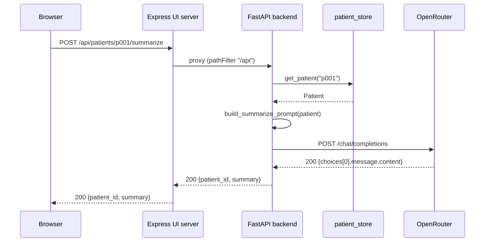
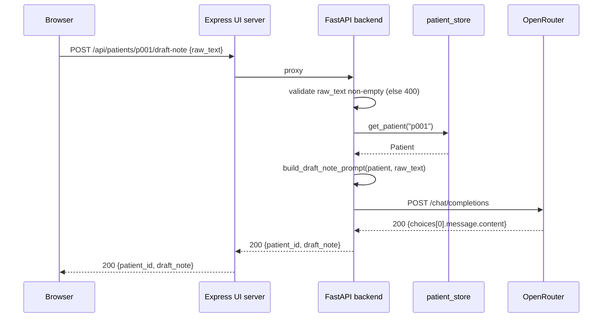

# Low-Level Design (LLD)

## Banner Health — AI Clinical Documentation Assistant (Prototype)

Companion to `docs/HLD.md`. Describes module boundaries, data contracts, and control flow at the
file/function level, matching the code as implemented.

## 1. Module Layout

```
backend/app/
├── main.py                 FastAPI app: CORS, router mounting, /api/health
├── models/schemas.py       Pydantic request/response models
├── routers/
│   ├── patients.py         GET /api/patients, GET /api/patients/{id}
│   ├── summarize.py        POST /api/patients/{id}/summarize
│   └── notes.py            POST /api/patients/{id}/draft-note
├── services/
│   ├── patient_store.py    Loads + caches app/data/patients.json in memory
│   ├── prompts.py          Builds the two LLM prompt templates
│   └── llm_client.py       OpenRouter HTTP client + error normalization
└── data/patients.json      Synthetic seed data (5 patients)

frontend/
├── server.js                Express: proxy /api -> backend, serve dist/, SPA fallback
├── vite.config.js            Dev server + /api proxy for `npm run dev`
├── src/api.js                fetch wrappers, unwraps {detail} error bodies
├── src/App.jsx                Top-level state: patients list, selected id, patient detail
└── src/components/
    ├── PatientList.jsx        Renders selectable patient list
    ├── PatientChart.jsx        Renders chart + "Summarize" action/result
    └── NoteDrafter.jsx         Textarea input, "Draft note" action, editable/copyable output
```

## 2. Data Model

`Patient` (backend/app/models/schemas.py), loaded from `data/patients.json`:

| Field | Type | Notes |
|---|---|---|
| `id` | `str` | e.g. `p001` |
| `name` | `str` | Clearly-fake name, e.g. "Test Patient A" |
| `age` | `int` | |
| `sex` | `str` | |
| `problem_list` | `list[str]` | |
| `medications` | `list[str]` | |
| `allergies` | `list[str]` | |
| `vitals` | `dict[str, str]` | Free-form key/value (bp, hr, a1c, etc.) |
| `visit_history` | `list[VisitNote]` | `VisitNote = {date: str, note: str}` |

`patient_store.py` loads the JSON file once (module-level `_patients` cache keyed by `id`) and
serves all reads from memory — no per-request disk I/O after the first call.

## 3. API Contract

All routes are prefixed `/api`.

### `GET /api/patients`
- Response `200`: `PatientSummary[]` → `{id, name, age, sex}` (chart detail omitted for the list view)

### `GET /api/patients/{id}`
- Response `200`: full `Patient` object
- Response `404`: `{detail: "No patient with id '<id>'"}`

### `POST /api/patients/{id}/summarize`
- No body
- Response `200`: `{patient_id: str, summary: str}`
- Response `404`: unknown patient
- Response `502`: LLM call failed (see §5) — `{detail: <message>}`

### `POST /api/patients/{id}/draft-note`
- Body: `{raw_text: str}`
- Response `200`: `{patient_id: str, draft_note: str}`
- Response `400`: `raw_text` empty/whitespace-only
- Response `404`: unknown patient
- Response `502`: LLM call failed

### `GET /api/health`
- Response `200`: `{status: "ok"}` — liveness check only, no dependency checks

## 4. Sequence Diagrams

### 4.1 Chart summarization



### 4.2 Note drafting



## 5. LLM Client Design (`services/llm_client.py`)

Single function `complete(prompt: str) -> str`, used by both routers. Behavior:

1. Reads `OPENROUTER_API_KEY` from env (via `python-dotenv` at startup) — raises `LLMError` with a
   setup hint if missing.
2. Reads `OPENROUTER_MODEL` (default `liquid/lfm-2.5-2.6b:free`).
3. POSTs to `https://openrouter.ai/api/v1/chat/completions` with a single user-role message and
   `temperature=0.3`, 60s timeout via `httpx.AsyncClient`.
4. Error mapping:
   | Condition | Result |
   |---|---|
   | Network/transport error | `LLMError("Could not reach OpenRouter: ...")` |
   | HTTP 429 | `LLMError("OpenRouter rate limit hit.", hint="Free-tier models have low rate limits...")` |
   | HTTP ≥ 400 (other) | `LLMError("OpenRouter returned an error (<code>): <body>")` |
   | Malformed 200 body | `LLMError("Unexpected response shape from OpenRouter: ...")` |
5. Routers catch `LLMError` and re-raise as `HTTPException(status_code=502, detail=str(exc))` —
   the frontend surfaces `detail` directly to the user.

Free-tier OpenRouter models are shared across many callers and can return `429` transiently; this
is expected/normal and handled as above rather than retried automatically (kept simple for the
prototype — see HLD §6 Reliability).

## 6. Prompt Design (`services/prompts.py`)

`_format_patient_context(patient)` renders a consistent plain-text block (demographics, problem
list, meds, allergies, vitals, visit history newest-first) reused by both prompt builders so the
model always sees the same chart representation.

- `build_summarize_prompt`: instructs a <150-word clinical brief — problems, meds, trends,
  follow-up flags.
- `build_draft_note_prompt`: instructs a SOAP-structured note, explicitly constrained to only use
  facts present in the chart context or the physician's raw text (no fabrication instruction) —
  mitigates hallucination risk given this drafts real clinical documentation content.

## 7. Frontend Design

`App.jsx` owns three pieces of state: `patients` (list), `selectedId`, `patient` (detail for the
selection). Two `useEffect`s: one fetches the list on mount, one re-fetches patient detail whenever
`selectedId` changes. Fetch errors are surfaced as inline text, not swallowed.

`api.js` centralizes fetch + error unwrapping: any non-2xx response's JSON `detail` field becomes
the thrown `Error.message`, so every component's catch block can just render `err.message`.

`PatientChart.jsx` and `NoteDrafter.jsx` each own their own `loading`/`error`/`result` state
locally (not lifted to `App`) since summarization and drafting are independent, patient-scoped
actions with no cross-component dependency.

`server.js` mounts the proxy with `pathFilter: "/api"` rather than `app.use("/api", proxy)` —
the latter causes Express to strip the `/api` prefix from `req.url` before the proxy sees it,
forwarding to the wrong backend path (`/patients` instead of `/api/patients`). This was caught
during verification and is the one non-obvious gotcha in the UI server.

## 8. Configuration

| Var | Where | Default | Purpose |
|---|---|---|---|
| `OPENROUTER_API_KEY` | backend `.env` | — (required) | Auth to OpenRouter |
| `OPENROUTER_MODEL` | backend `.env` | `liquid/lfm-2.5-2.6b:free` | Model slug; rotate if a free model becomes unavailable |
| `BACKEND_URL` | frontend env | `http://localhost:8000` | Proxy target for `server.js` |
| `PORT` | frontend env | `3000` | Express UI server port |

## 9. Known Limitations

- No retry/backoff on LLM 429s — a transient upstream limit surfaces directly to the user.
- Patient cache is process-lifetime, load-once — a change to `patients.json` requires a backend
  restart to take effect.
- No persistence: summaries and drafted notes exist only in the browser session; nothing is
  written back to `patients.json` or any store.
- Single-instance assumption throughout (in-memory cache, no shared session state) — not
  horizontally scaled as-is.
